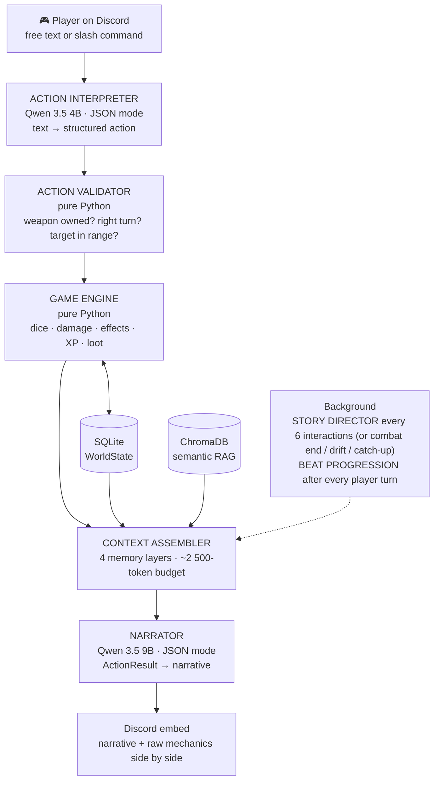

# RealmAI Engine

[](https://github.com/CocoLng/RealmAI-Engine/actions/workflows/ci.yml)
[](LICENSE)
[](https://www.python.org/downloads/)
[](https://github.com/Rapptz/discord.py)
[](https://docs.pydantic.dev/latest/)
[](https://github.com/astral-sh/ruff)
[](https://mypy-lang.org/)
[](#run-the-test-suite)

An AI-powered RPG Game Master that runs as a Discord bot. A deterministic
Python engine handles all game mechanics (dice, combat, inventory, rules).
Local LLMs via Ollama handle narration only. The engine is also exposed as
an MCP server for live-testing the bot from Claude Code.

**The LLM narrates. The code arbitrates. No exceptions.**

> **Status — July 2026:** Phases 1-3 shipped; Phase 4 (polish + ship) in
> progress. CI freezes the three quality gates (ruff, mypy, pytest — ~2 910
> tests) on every push, and the full lobby → character creation →
> opening-narrative flow is verified against live Discord. Remaining:
> real multi-player sessions, demo GIFs, write-up. See
> [`docs/internal/STATE.md`](docs/internal/STATE.md) for the exact
> implementation status.

## Why this project

Most AI D&D projects let the LLM decide everything — dice rolls, damage,
loot. That leads to inconsistent rules, easy exploits, and broken immersion.
RealmAI Engine takes a different approach: a strict Python engine enforces
all mechanics, and the LLM is a blind narrator that describes what happened.
No other open-source project combines a deterministic engine + LLM narration
+ MCP server + Discord multiplayer.

## Demo

> _Screenshots / GIFs coming soon._ Drop real captures into `docs/assets/`
> and uncomment the lines below.

<!-- Suggested shots:
     1. /start_campaign lobby + character creation
     2. A free-form @mention action → narrative embed with raw mechanics
     3. A combat turn with the Attack/Cast/Defend/Flee buttons
     4. The arc tracker pinned message -->
<!--  -->
<!--  -->

## Features

- **Deterministic 5e-style engine** — dice, 6 classes × 7 races, a 25-item
  catalogue, 21 spells, 18 conditions, and multi-enemy combat with initiative,
  surprise, death saves, and tiered NPC AI (minion → elite → boss).
- **Blind LLM narration** — the narrator only turns an `ActionResult` into
  prose; it never decides an outcome. Discord shows the narrative **and** the
  raw mechanics side by side.
- **Free-form play** — `@mention` the bot in plain language ("je fouille
  l'autel", "j'attaque le gobelin"); a 4B interpreter maps it to a structured
  action the engine validates and resolves.
- **Story that remembers** — 4-layer memory (SQLite state, sliding window,
  auto summaries, ChromaDB RAG) keeps each ~2 500-token prompt grounded; a
  Story Director and beat-progression engine keep the arc coherent.
- **Multiplayer campaigns** — one dedicated channel per campaign, a join/leave
  lobby, per-guild language (FR/EN/ES/DE/PT), save/resume, and channel
  archival on `/end_campaign`.
- **Built to be tested** — ~2 910 tests, 63 end-to-end scenarios, and an
  autonomous LLM playthrough simulator that hunts for narrative incoherence.

### Commands

| Command | What it does |
|---|---|
| `/start_campaign` | Open a lobby; players join, build characters, then launch |
| `@RealmAI <action>` | Free-form action in natural language (the main game loop) |
| `/character` · `/level_up` | View your sheet · spend XP to level up |
| `/inventory` · `/equip` · `/unequip` · `/use_item` | Manage gear (recomputes AC) |
| `/roll 2d6+3` | Ad-hoc dice with a full breakdown |
| `/hint` | Three escalating hint tiers (vague → objectives → concrete) |
| `/story_catch_up` | Story Director recap of the current objective + hooks |
| `/save` · `/resume` · `/end_campaign` | Persist · reload · archive a campaign |
| `/settings` · `/add_member` | Guild category & language · add a player/viewer |

## Architecture (one-screen view)



The technical reference is in **[`ARCHITECTURE.md`](ARCHITECTURE.md)** —
module map, pipeline phases, persistence layout, invariants, extension
points.

### Memory system (4 layers)

| Layer | Source | Budget | Truncation |
|---|---|---:|---|
| 1. Structured state | SQLite snapshot | 450 tok | never |
| 2. Sliding window | last 12 exchanges | 700 tok | oldest first |
| 3. Compressed summaries | auto-generated every ~20 turns | 400 tok | oldest first |
| 4. Semantic RAG | ChromaDB (1 collection per campaign) | 350 tok | lowest score first |

## Tech stack

| Component | Technology |
|---|---|
| Language | Python 3.12+ |
| Package manager | [uv](https://docs.astral.sh/uv/) |
| Discord bot | discord.py 2.7+ |
| Data models | Pydantic v2 |
| Persistence | SQLAlchemy + SQLite |
| Semantic memory | ChromaDB |
| LLM inference | Ollama (local, OpenAI-compatible API) |
| MCP server | mcp Python SDK |
| Tests | pytest (+ pytest-asyncio, pytest-httpx, pytest-cov) |
| Linting | ruff |
| Type checking | mypy |

### LLM models (Ollama)

- **Narrator**: `qwen3.5:9b` (6.6 GB, ~25-35 tok/s on M3 Pro) — immersive narrative
- **Interpreter**: `qwen3.5:4b` (~3 GB, ~50-70 tok/s) — fast text-to-JSON parsing

Models are never loaded simultaneously to stay within the 18 GB memory
budget. JSON mode is forced everywhere — Ollama's native tool calling is
broken with Qwen 3.5 (see `ai/client.py`).

## Project structure

```
realmai-engine/
├── engine/          # Pure Python game logic (NO LLM EVER)
├── ai/              # LLM services (interpreter, narrator, tacticien, generators)
├── memory/          # 4-layer context assembly
├── world/           # Domain Pydantic models
├── bot/             # Discord bot — cogs, pipeline, views, embeds, lobby
├── mcp_discord/     # MCP server for Discord live-testing automation
├── db/              # SQLAlchemy models, mappers, repositories
├── data/            # Local SQLite + ChromaDB (gitignored)
├── logs/            # Runtime logs + story bibles (gitignored)
├── docs/
│   ├── internal/    # Up-to-date technical docs (architecture, flows, state)
│   └── superpowers/ # Historical design plans & specs
├── tasks/           # In-flight work tracking + accumulated lessons
├── tests/           # pytest unit tests + ScenarioRunner e2e
├── ARCHITECTURE.md  # Technical entry point
├── CLAUDE.md        # Conventions for Claude Code agents
└── README.md
```

## Documentation

- **[ARCHITECTURE.md](ARCHITECTURE.md)** — technical entry point: layers,
  pipeline, persistence, invariants, extension points.
- **[docs/internal/](docs/internal/README.md)** — exhaustive technical
  reference, kept in lockstep with the code:
  - [ARCHITECTURE.md](docs/internal/ARCHITECTURE.md) — deep architecture (FR)
  - [STATE.md](docs/internal/STATE.md) — implemented vs. pending
  - [ISSUES.md](docs/internal/ISSUES.md) — known bugs, tech debt
  - [CAMPAIGN_LIFECYCLE.md](docs/internal/CAMPAIGN_LIFECYCLE.md) — `/start_campaign` → onboarding → save/resume → `/end_campaign`
  - [ACTION_PIPELINE.md](docs/internal/ACTION_PIPELINE.md) — the 6-phase pipeline
  - [COMBAT_SYSTEM.md](docs/internal/COMBAT_SYSTEM.md) — combat reference (modules, models, pipeline, API)
  - [NARRATIVE_COHERENCE.md](docs/internal/NARRATIVE_COHERENCE.md) — locked canon, NPCs, Story Director
  - [MEMORY_SYSTEM.md](docs/internal/MEMORY_SYSTEM.md) — 4-layer context assembly
  - [GAME_ENGINE.md](docs/internal/GAME_ENGINE.md) — deterministic rules module by module
  - [AI_LAYER.md](docs/internal/AI_LAYER.md) — Ollama services, prompts, retry logic
  - [DISCORD_BOT.md](docs/internal/DISCORD_BOT.md) — cogs, views, embeds, sessions
  - [DATABASE.md](docs/internal/DATABASE.md) — SQLAlchemy schema + repositories
  - [TESTING.md](docs/internal/TESTING.md) — pytest, ScenarioRunner, MCP Discord
- **[CLAUDE.md](CLAUDE.md)** — workflow conventions and coding standards for
  AI agents working in the repo.
- **[tasks/lessons.md](tasks/lessons.md)** — lessons accumulated across
  refactors (worth reading before touching memory, combat, or persistence).

## Getting started

### Prerequisites

- Python 3.12+
- [uv](https://docs.astral.sh/uv/) (package manager)
- [Ollama](https://ollama.com/) (local LLM inference)
- A Discord bot token (see `.env.example`)

### Setup

```bash
# Clone the repo
git clone https://github.com/CocoLng/RealmAI-Engine.git
cd RealmAI-Engine

# Install dependencies (creates .venv, installs from uv.lock)
uv sync

# Pull the LLM models (~10 GB total)
ollama pull qwen3.5:9b
ollama pull qwen3.5:4b

# Configure the bot token
cp .env.example .env
# edit .env and set DISCORD_BOT_TOKEN
```

### Run the bot

```bash
uv run python main.py
```

### Run the test suite

```bash
uv run pytest                  # full suite (~2 910 tests)
uv run pytest tests/engine -q  # engine only
uv run pytest tests/scenarios  # end-to-end scenarios via ScenarioRunner
```

### Autonomous playthrough simulator

Drive an LLM agent through a whole campaign and check for narrative-coherence
violations — it catches regressions a unit test can't see:

```bash
uv run python -m tests.simulation --mock-llm --max-turns 20   # fast, deterministic
uv run python -m tests.simulation --max-turns 30              # real Ollama
```

Each run lands in `tests/simulation/runs/<timestamp>/` (turn records, state
diffs, coherence alerts, exit code).

### Quality gates

```bash
uv run ruff check .            # linting
uv run mypy                    # type checking — no argument: pyproject's
                               # `files` key defines the scan surface
```

### Reset local game data

`data/realmai.db` and `data/chromadb/` are dev-only. To wipe them:

```bash
uv run python scripts/reset_dev_data.py
```

## Design principles

- **The LLM never decides mechanics** — dice, damage, loot, advancement, and
  combat outcomes are all deterministic Python.
- **Pydantic v2 everywhere in the domain** — strict types, no raw dicts at
  module boundaries.
- **Structured outputs only** — every Ollama call sets
  `response_format={"type": "json_object"}`; no regex parsing of free text.
- **Anti-cheat by design** — `ActionValidator` checks every action before
  the engine processes it. Discord shows both the narrative *and* the raw
  mechanics (dice, modifiers, outcomes).
- **Self-reconciling schema** — on startup `init_db` runs `create_all()` and
  then adds any model column an existing table is missing
  ([`db/migrations.py`](db/migrations.py)), tracked by a `schema_version`. So a
  new column is safe on an existing DB. `data/` is gitignored and resettable
  with `scripts/reset_dev_data.py`; complex migrations (renames, backfills)
  remain a Phase 4 item.

## Contributing

Contributions are welcome. See **[CONTRIBUTING.md](CONTRIBUTING.md)** for the
dev setup, the quality gates, and the engine invariants to respect (most
importantly: no LLM calls in `engine/`). By participating you agree to the
[Code of Conduct](CODE_OF_CONDUCT.md). Found a security issue? See
[SECURITY.md](SECURITY.md) — please don't open a public issue for it.

## License

MIT — see [LICENSE](LICENSE).
